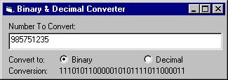



## Best & Simplest Binary \- Decimal Converter\!\!\!

### Description

The best, simplest number conversion ever! There are only 2 lines of code to convert decimal to binary (or to any other base from 2 to 10). Contains 2 VERY simple functions, one to convert binary to decimal, the other does the opposete. I'd like to know what you think about it so any feedback would be welcome.
 
### More Info
 
You enter the number, you get its conversion.

The conversion functions can convert numbers in base 2,3,4,5,6,7,8,9,10!

You get its conversion.

Try not to enter numbers that are too large your computer might crash. I have set a maxlength on the textbox.

             |
---                |---
**Submitted On**   |2002-08-03 16:40:16
**By**             |[Sum1 Cool](https://github.com/Planet-Source-Code/PSCIndex/blob/master/ByAuthor/sum1-cool.md)
**Level**          |Beginner
**User Rating**    |3.0 (9 globes from 3 users)
**Compatibility**  |VB 5\.0, VB 6\.0
**Category**       |[Math/ Dates](https://github.com/Planet-Source-Code/PSCIndex/blob/master/ByCategory/math-dates__1-37.md)
**World**          |[Visual Basic](https://github.com/Planet-Source-Code/PSCIndex/blob/master/ByWorld/visual-basic.md)
**Archive File**   |[Best\_Binar113873832002\.zip](https://github.com/Planet-Source-Code/sum1-cool-best-simplest-binary-decimal-converter__1-37563/archive/master.zip)

